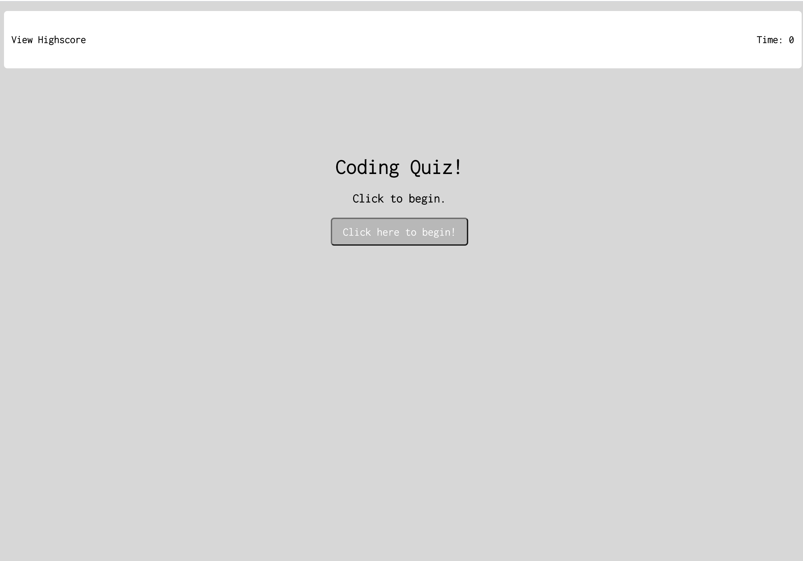

# 04 Web APIs: Code Quiz

This app is a multiple-choice question Coding Quiz.  Test your knowledge but be aware of the ticking time on the right hand corner!  Try to answer all the questions before the time runs out so you can get your name on the High Score! This app runs in the browser and features dynamically updated HTML, CSS, and powered by Javascript.  

## User Story

```
AS A coding bootcamp student
I WANT to take a timed quiz on JavaScript fundamentals that stores high scores
SO THAT I can gauge my progress compared to my peers
```



